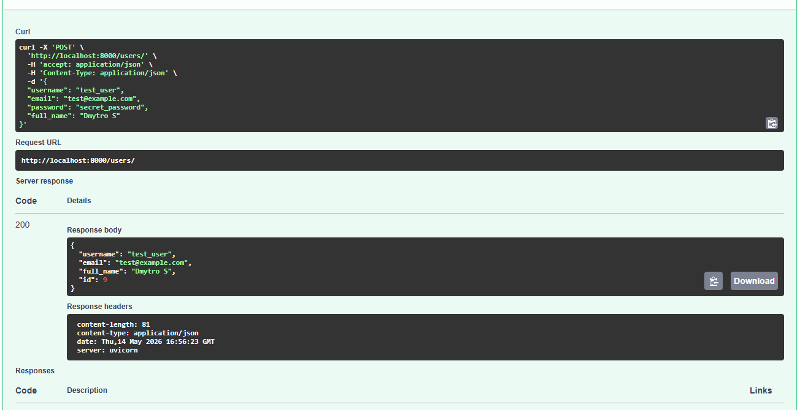
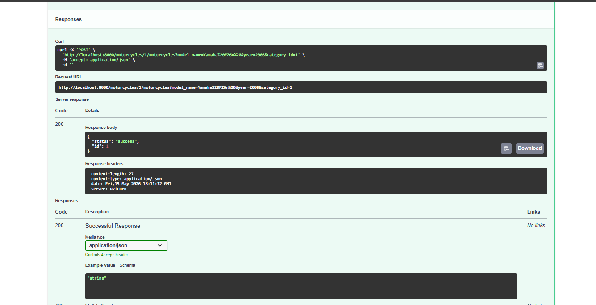
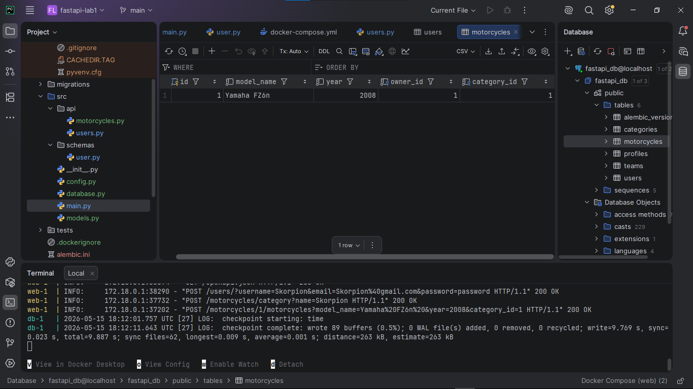
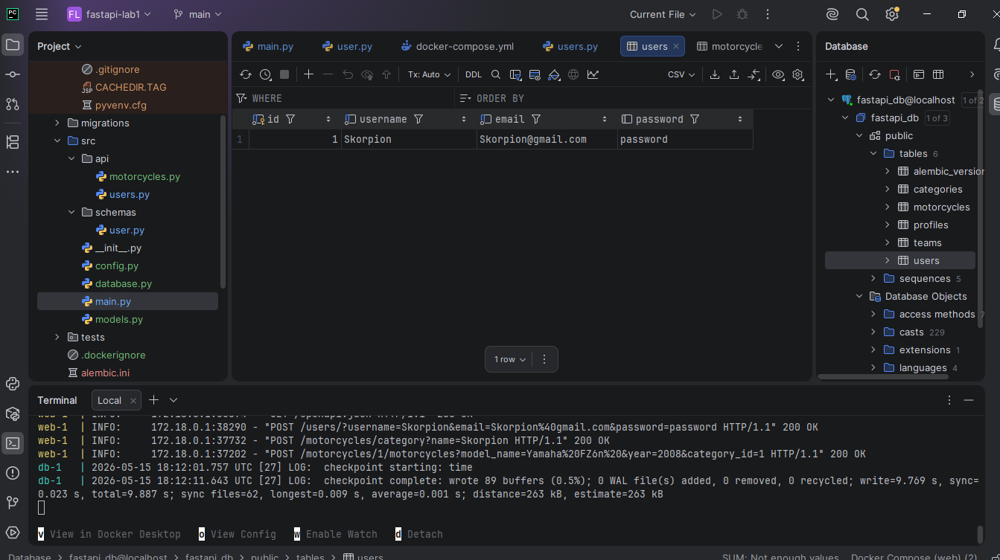

## FastAPI Lab 1

RaceHub API is a FastAPI application with async SQLAlchemy, PostgreSQL, Alembic migrations, Docker Compose, and Poetry dependency management.

## Run with Docker

Build and start the regular stack:

```powershell
docker compose up --build
```

The API will be available at:

- `http://localhost:8000`
- `http://localhost:8000/docs`

The `db` service has a healthcheck, so the API starts only after PostgreSQL is ready. Database migrations run once in `entrypoint.sh` with:

```sh
poetry run alembic upgrade head
```

## Development Mode

Use the development override when you need live reload and the project folder mounted into the container:

```powershell
docker compose -f docker-compose.yml -f docker-compose.dev.yml up --build
```

Stop containers:

```powershell
docker compose down
```

## Local Poetry Setup

Install dependencies:

```powershell
poetry install --no-root
```

Run migrations:

```powershell
poetry run alembic upgrade head
```

Run the API locally:

```powershell
poetry run uvicorn src.main:app --reload
```

## API Resources

CRUD endpoints are available for:

- `/users/`
- `/profiles/`
- `/categories/`
- `/teams/`
- `/motorcycles/`

## Postman Checks

The repository includes Postman screenshots for the lab checks:



Additional lab screenshots:




